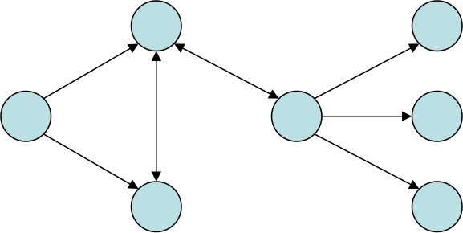
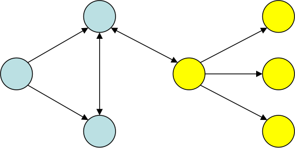
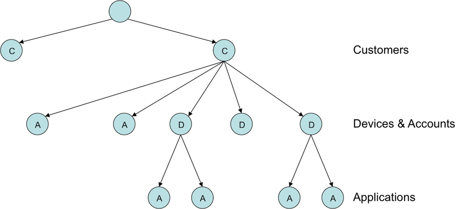
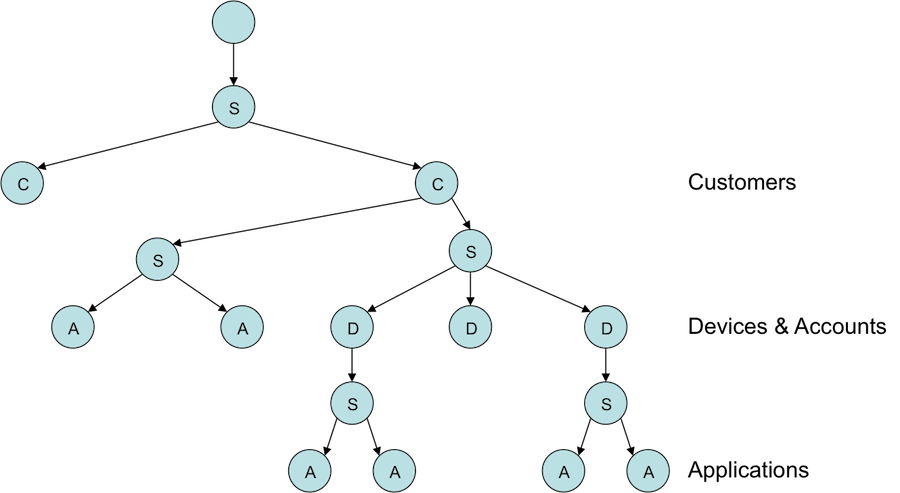

!SLIDE title-page
## Effective Actors

Jamie Allen

jamie.allen@typesafe.com

@jamie_allen

github.com/jamie-allen

  

!SLIDE transition=blindY
# Groundwork - What Are Actors?

* Concurrent lightweight processes that communicate through asynchronous message passing
* Isolation of state, no internal concurrency

!SLIDE transition=blindY
# Akka Actor Code

	case class Start(thePonger: ActorRef)
	class Pinger extends Actor {
	    def receive = {
	      case Start(x) => x ! "Ping!"
	      case x => println("Pinger: " + x); sender ! "Ping!"
	    }
	}
	class Ponger extends Actor { 
	  def receive = { case x => println("Ponger: " + x); sender ! "Pong!" } 
	}

	object PingPong extends App {
	  val system = ActorSystem()
	  val ponger = system.actorOf(Props[Ponger])
	  val pinger = system.actorOf(Props[Pinger])
	  pinger ! Start(ponger)
	}

!SLIDE transition=blindY
# Groundwork - Supervisor Hierarchy
.notes Don't try to predict every possible thing that can go wrong.  Instead, understand how to reset your actor system and retry until it works.

* Specifies handling mechanisms for groupings of actors in parent/child relationship 

!SLIDE transition=blindY
# Akka Supervision Code

	class MySupervisor extends Actor {
      override val supervisorStrategy = OneForOneStrategy(
      	  maxNrOfRetries = 10, 
      	  withinTimeRange = 1 minute) {

        case ae: ArithmeticException => Resume
        case np: NullPointerException => Restart
      }

      context.actorOf(Props[MyActor])
    }

!SLIDE transition=blindY
# Groundwork - Parallelism

* Easily scale a task by creating multiple instances of an actor and applying work using various strategies
* Order is not guaranteed, nor should it be
* Focus on idempotent, "pure" functions

!SLIDE transition=blindY
# Akka Routing
.notes Of course, my example shows an impure function (writing to the console is a side effect)

	object Parallelizer extends App {
	  class MyActor extends Actor { 
	  	def receive = { case x => println(x) }
	  }

	  val system = ActorSystem()
	  val router: ActorRef = system.actorOf(Props[MyActor].
	  	withRouter(RoundRobinRouter(nrOfInstances = 5)))

	  for (i <- 1 to 10) router ! i
	}

!SLIDE transition=blindY
# Effective Actors

* Best practices based on several years of actor development
* Helpful hints for reasoning about actors at runtime

!SLIDE transition=blindY
# RULE

Actors Should Only Do One Thing

!SLIDE transition=blindY
# Single Responsibility Principle

* Do not conflate responsibilities in actors
* Becomes hard to define the boundaries of responsibility
* Supervision becomes more difficult as you handle more possibilities
* Debugging becomes very difficult

!SLIDE transition=blindY
# Actor Behavior

* Actors handling messages should only:
	* handle messages
	* Delegate messages
	* Forward messages
	* Supervise supervisors under them

!SLIDE transition=blindY
# Supervision
.notes Any actor with child actors is responsible for supervising them, even if those child actors are supervisors themselves.  You shouldn't necessarily let that parent actor try to supervise all actors below it, but try to create "failure zones" by actor type.  If a Customer actor has multiple devices and multiple accounts below it, it should have a DeviceSupervisor and an AccountSupervisor between them, not supervise all directly.

* Every non-leaf node is technically a supervisor
* Create explicit supervisors under each node for each type of child to be managed
* Supervisors should do nothing except manage their actors

!SLIDE transition=blindY
# Conflated Supervisors

!SLIDE transition=blindY
# Explicit Supervisors

!SLIDE transition=blindY
# Keep the Error Kernel Simple

* Limit the number of supervisors you create in it
* Helps with fault tolerance and explicit handling of errors through the hierarchy
* Akka uses synchronous messaging to create top-level actors

!SLIDE transition=blindY
# Failure Zones

* Create "sandboxes" your actor system
	* Multiple isolated zones with their own dispatcher
	* Protects thread pools to prevent starvation
	* Prevents issues in one branch from affecting another

!SLIDE transition=blindY
# Takeaway
.notes Shallow trees mean you may be trying to do too much with too few actors.

* For reasonably complex actor systems, shallow trees are a smell test
* Actors are cheap.  Use them.

!SLIDE transition=blindY
# RULE

Never Block in an Actor

!SLIDE transition=blindY
# Consequences of Blocking
.notes If you are blocking on IO/locks, then tying up a thread is a massive waste of memory resources

* Passively waiting when that thread can be doing other things
* Eventually results in actor starvation as thread pool dries up
* Horrible performance
* Massive waste of system resources

!SLIDE transition=blindY
# Futures and Timeouts

* Futures are composable tasks to be performed asynchronously
* Timeout within a reasonable period of time
* Exponential backoff
* Handle failure

!SLIDE transition=blindY
# Futures

	import akka.actor.{ Actor, ActorSystem, Props, Status }
	import akka.dispatch.Future
	import akka.pattern.ask
	import akka.util.Timeout
	import akka.util.duration._

	case class SumSequence(ints: Seq[Int])
	class Worker extends Actor {
	  def receive = {
	    case s: SumSequence => sender ! (
	      try { s.ints.reduce(_ + _) }
	      catch { case NonFatal(e) => log.error(e, "Non-fatal exception")
	  }
	}

	object Bootstrapper extends App {
	  val system = ActorSystem()
	  val worker = system.actorOf(Props[Worker])
	  implicit val timeout: Timeout = 2 seconds

	  try {
	    val workFut = worker ? SumSequence(1 to 100)
	    workFut.onComplete {
	      case Left(x: Throwable) => println("Exception: %s".format(x.getMessage))
	      case Right(y) => println("Got a result: " + y)
	    }
	  } finally { system.shutdown }
	}

!SLIDE transition=blindY
# What If I MUST Block?

* Use a specialized actor with its own dispatcher
* Does not affect the thread pool of other actors
* Passes messages to actors to handle

!SLIDE transition=blindY
# Push, not Pull
.notes You'll be surprised at how few places require guaranteed delivery in your system when you take this route.

* Start with no guarantees about delivery
* Add guarantees only where you need them
* Retry until you get the answer you expect
* Switch your actor to a "nominal" state at that point

!SLIDE transition=blindY
# RULE

Do Not Optimize Prematurely

!SLIDE transition=blindY
# Start Simply

* Start with a simple configuration and profile
* Use mailbox sizes to determine where to reconfigure
* Do not parallelize until you know you need to and where

!SLIDE transition=blindY
# Initial Focus
.notes In other words, start without using Actors!  Declarative is expressing the logic of a computation but not the control flow - no side effects, referentially transparent; Logic and Functional Programming are subsets.

* Deterministic
* Declarative
* Immutable

!SLIDE transition=blindY
# Advice from Jonas Bonér
.notes From Jonas' Jazoon 2012 keynote speech.  Applies to your system on the whole, where actors are just one part.

* Layer in complexity
* Add indeterminism (actors and agents)
* Add mutability in hot spots (CAS and STM)
* Add explicit locking and threads

!SLIDE transition=blindY
# Prepare for Race Conditions

* Write actor code to be agnostic of time and order
* Actors should only care about now, not that something happened before it
* Actors can "become" or represent state machines to represent transitions

!SLIDE transition=blindY
# Beware the Thundering Herd

* Actor systems can be overwhelmed by "storms" of messages flying about
* Do not pass generic messages that apply to many actors, be specific
* Dampen actor messages if the exact same message is being handled repeatedly within a certain timeframe
* Tune your dispatchers and mailboxes
	* Back-off policies
	* Queue sizes

!SLIDE transition=blindY
# RULE
.notes Being general about actor interations will hurt you.  Be as granular with your messages and exceptions as you possibly can be.

Be Specific in Your Intent

!SLIDE transition=blindY
# Name Your Actors

* Allows for external configuration
* Allows for lookup
* Better semantic logging

!SLIDE transition=blindY
# Create Specialized Messages

* Non-specific messages about general events are dangerous
	* Example: "AccountsUpdated"
* Can result in "event storms" as all actors react to them
* Use specific messages forwarded to actors for handling
	* Example "AccountDeviceAdded(acctNum, deviceNum)"

!SLIDE transition=blindY
# Create Specialized Exceptions
.notes Throwing back Exception means you can't have different handling strategies for different scenarios.  If needed, you can pass data within the specific exception back to the supervisor and then provide it in the postRestart of the next actor incarnation, but don't do this without some serious consideration - by default, recompute or retrieve again first.

* Don't use Exception to represent failure in an actor
* Specific exceptions can be handled explicitly
* State can be transferred between incarnations

!SLIDE transition=blindY
# RULE

Do Not Expose Your Actors

!SLIDE transition=blindY
# No Direct References to Other Actors
.notes This is specific to JVM implementations of actors, not Erlang.  Erlang processes cannot call methods on actors, where JVM-based actors are just instances of objects.

* Actors die
* Doesn't prevent someone from calling into an actor with another thread
* Akka solves this with the ActorRef abstraction
* Erlang solves this with PIDs

!SLIDE transition=blindY
# Never Publish "this"
.notes Don't ever hand out closures with ‘this’ outer reference; especially take care with Future callbacks.  Copying to local vals helps.

* Don't send it anywhere
* Don't register it anywhere
* Particularly with future callbacks
* Avoid closing over "sender" in Akka, it will change with the next message

!SLIDE transition=blindY
# Use Immutable Messages
.notes If the encapsulation of actors is broken by exposing their mutable state to the outside, you are back in normal Java concurrency land with all the drawbacks.

* Enforces which actor owns the data
* If mutable state can escape, what is the point of using an actor?

!SLIDE transition=blindY
# Pass Copies of Mutable Data
.notes When you do have mutable data, for whatever reason.  Comes at a cost, but it's well worth it.  If the copy on write semantics hurt your system, you'll have to find other ways to optimize.  Or get rid of the mutable state itself.

* Data can escape your scope
* Copy the data and pass that, as Erlang does (COW)
* Akka has STM references

!SLIDE transition=blindY
# Avoid Sending Behavior
.notes Jonas isn't a big fan of sending "become" partial functions to actors, though Joe Armstrong likes it a great deal.

* Unless using Agents, of course
* Closures make this possible (and easy)
* Also makes it easy for state to escape

!SLIDE transition=blindY
# RULE

Make Debugging Easier

!SLIDE transition=blindY
# Externalize Business Logic
.notes You just want to prove that your business logic works as expected, but actors are tricky this way.  Receiving a message and calculating a value can result in side effects such as creating new actors, which may be entirely unrelated from what you're trying to test.  Use integration tests to prove that actors are behaving as expected.

* Use external functions to encapsulate business logic
* Easier to unit test outside of actor context
* Not a rule of thumb, but something to consider as complexity increases
* Not as big of an issue with Akka's TestKit

!SLIDE transition=blindY
# Use Semantically Useful Logging
.notes Yes, it makes your code ugly, and yes, it makes your logs huge.  But it's so much more readable than inline output and will pay off in a crisis.

* Trace-level logs should have output that you can read easily
* Use line-breaks and indentation
* Both Akka and Erlang support hooking in multiple listeners to the event log stream

!SLIDE transition=blindY
# Unique IDs for Messages
.notes Doesn't have to be UUIDs, just something that you can have a fair amount of certainty will be unique for a reasonable period of time, such as a day.  Actor logging *should* be asynchronous, and may not reflect the order messages were handled and passed along.

* Allows you to track message flow
* When you find a problem, get the ID of the message that led to it
* Use the ID to grep your logs and display output just for that message flow
* Akka ensures ordering on a per actor basis, also in logging

!SLIDE transition=blindY
# Monitor Everything
.notes It will hurt much more to try to add this in later.

* Do it from the start
* Use tools like JMX MBeans to visualize actor realization
* The Atmos/Typesafe Console to monitor everything
	* Doesn't require you to do anything up front
* Visual representations of actor systems at runtime are invaluable

!SLIDE transition=blindY
# Credits

* The Typesafe Team
	* Jonas Bonér
	* Viktor Klang
	* Roland Kuhn
	* Havoc Pennington
